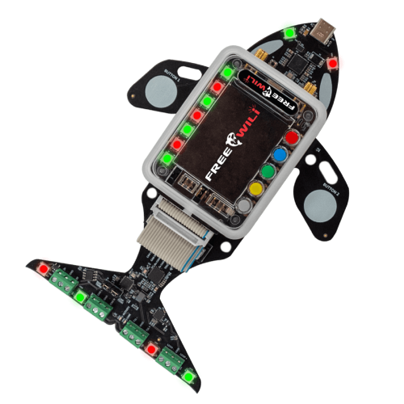
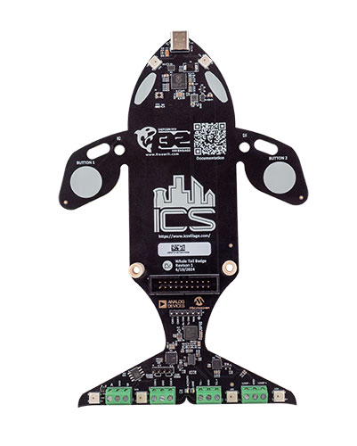
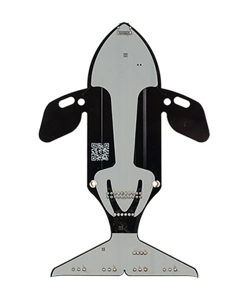

# Introduction and Overview

## Introduction

Thank you for purchasing a FREE-WILi Whale Tail tool sponsored by [Microchip](https://www.microchip.com/), [Analog Devices](https://www.analog.com/en/index.html) and [ICS Village](https://www.icsvillage.com/). Thanks to our sponsors for allowing us to keep the prices low for everyone to get access to this badge at an affordable price.

FREE-WILi teamed up with Defcon industrial control systems (ICS) village to bring you an ICS first ever badge. The badge will make your Defcon experience more memorable by highlighting digital protocols commonly used in industrial settings. This innovative badge features cutting-edge technologies like [CAN FD](https://www.microchip.com/en-us/products/interface-and-connectivity/can) and [10BASE-T1L](https://www.analog.com/en/resources/technical-articles/enabling-seamless-ethernet-to-field-with-10base-t1l-connectivity.html), making it a versatile tool for both learning and application in industrial and automotive environments.

At the heart of the Whale Tail Badge is a RP2040 Microcontroller

## Package Contents

If you purchase the Whale Tail from the Defcon 32 industrial control systems (ICS) then you will have received a Whale Tail badge, cable to add [FREE-WILi device](https://freewili.com/) and RF-Controlled LED Bracelets.

## Operational Overview

With a Raspberry Pi Pico, the uses are infinite! However, this isn't just a Raspberry Pi Pico, your Whale Tail features a variety of interfaces and capabilities, including a 10BASE-T1L interface for lightweight, long-distance data transmission up to 10 Mbps, a CAN FD interface, an RS485 Modbus interface, and a 4-20mA sensor simulator. It also includes 6 programmable RGB LEDs, 2 capacitive touch sensors, and an expansion plug for adding display, power, and wireless modules using FREE-WILi. This versatile badge is designed for seamless integration and programming, making it suitable for testing and development purposes.

<figure>

<figcaption>Whale Tail Badge Overview</figcaption>
</figure>

## Block Diagram

**FREE-WILi Whale Tail Front Side -**

<figure>

<figcaption>FREE-WILi Whale Tail Front View</figcaption>
</figure>

**FREE-WILi Whale Tail Back Side -**

<figure>

<figcaption>FREE-WILi Whale Tail Back View</figcaption>
</figure>

## Summary of Key Features

- 1x 10BASE-T1L Interface based on [Analog Devices ADIN1110](https://www.analog.com/en/resources/technical-articles/enabling-seamless-ethernet-to-field-with-10base-t1l-connectivity.html) 
- 1x CAN FD Interface: Based on [Microchip MCP2518FD](https://www.microchip.com/en-us/product/MCP2518FD) binary compatible with [CANIS lab CANPICO](https://canislabs.com/canpico/)
- Black contains two Texas Instruments CC1101 Sub Ghz Radios with programmable filter ranges for 300-348, 387-464, 779-928 bands.
- RS485 Modbus Interface
- 6x Serial RGB Color Programmable LED
- 4-20mA Sensor Simulator
- Expansion Plug for [FREE-WILi](https://freewili.com/) Device

## Hardware and Software Requirements

- USB Type C cable for power and configuration
- Optional [FREE-WILi](https://freewili.com/) Device