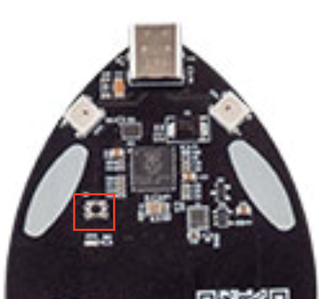

# Setup

## How to download a UF2 File to your Whale Tail Badge

Download the FREE-WILi Whale Tail Badge UF2 File at #

### CONNECT THE Whale Tail TO YOUR COMPUTER

1) Connect the USB Type C cable to your host computer.

2) Connect the other end of the USB cable to the while you press and hold the button button on the hardware. This will cause the Raspberry Pi Pico to enter bootloader mode and allow you to upload a new UF2 File.

<figure>

<figcaption></figcaption>
</figure>

1) Release the button once the cable is connected.

2) A disk volume called RPI-RP2 will appear on your computer.

### Load a UF2 File to the Raspberry Pi Pico

- Open RPI-RP2 on your computer by double-clicking it.4
- Drag and drop the .uf2 file that you downloaded earlier.

**RPI-RP2 will unmount and the LEDs on your whale tail will start blinking**

You’ve just uploaded the first bit of code to your Whale Tail Badge!