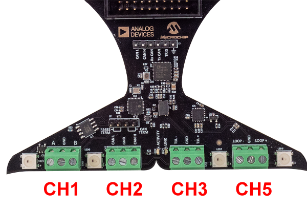

# Whale Tail Badge Tour and Pinout

## Pinout

<figure>

<figcaption>Green Connector Channel Pinout</figcaption>
</figure>

|        **PIN#**        	| **1** 	| **2** 	|  **3** 	|
|:----------------------:	|:-----:	|:-----:	|:------:	|
| CH1 - ModBus           	| A     	| GND   	| B      	|
| CH2 - CAN FD           	| CAN L 	| GND   	| CAN H  	|
| CH3 - 10BASE-T1L       	| T1L-  	| GND   	| T1L+   	|
| CH4 - Sensor Simulator 	| Loop  	| GND   	| Loop + 	|

## GPIO Pin Descriptions​

The table below describes the pins. All GPIO except dedicated pins can be used bidirectionally depending on the application. So the directions are the default.

| **Pin** 	| **Description** 	| **Default Direction** 	|                                   **Notes**                                  	|
|:-------:	|:---------------:	|:---------------------:	|:----------------------------------------------------------------------------:	|
| 1       	|                 	|                       	|                                                                              	|
| 2       	| 5V Out          	| Output                	| 5V to power IO and external circuit                                          	|
| 3       	| GPIO27 OUT      	| Output                	| RPi 2040 GPIO27                                                              	|
| 4       	| V PINS IN       	| Input                 	| Input to set the IO voltage 1.1 to 5.5V                                      	|
| 5       	| UART1 Rx IN     	| Input                 	| RPi 2040 UART 1 Receive (GPIO9)                                              	|
| 6       	| 3.3V Out        	| Output                	| 3.3 V to Power IO and external circuit                                       	|
| 7       	| UART1 CTS IN    	| Input                 	| RPi 2040 UART 1 Clear To Send (GPIO10)5                                      	|
| 8       	|                 	|                       	|                                                                              	|
| 9       	| UART1 TX OUT    	| Output                	| RPi 2040 UART1 Transmit (GPIO8)                                              	|
| 10      	|                 	|                       	|                                                                              	|
| 11      	| UART1 RTS OUT   	| Output                	| RPi 2040 UART 1 Request To Send (GPIO11)                                     	|
| 12      	|                 	|                       	|                                                                              	|
| 13      	|                 	|                       	|                                                                              	|
| 14      	| GPIO 26 IN      	| Input                 	| RPi 2040 GPIO26                                                              	|
| 15      	| SPI1 SCLK OUT   	| Output                	| RPi 2040 SPI 1 Clock (GPIO14)                                                	|
| 16      	|                 	|                       	|                                                                              	|
| 17      	| GPIO25 OUT      	| Output                	| RPi 2040 GPIO25. GPIO25 also connects to board status LED (same as RPi Pico) 	|
| 18      	|                 	|                       	|                                                                              	|
| 19      	| GND             	|                       	|                                                                              	|
| 20      	| GND             	|                       	|                                                                              	|

<figure>

<figcaption>Green Connector Channel Pinout</figcaption>
</figure>

